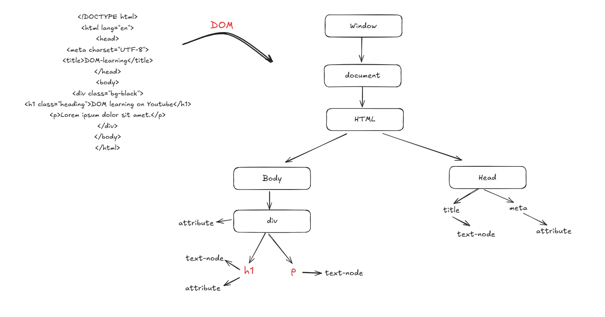

# 📘 Introduction to DOM in JavaScript

Welcome to the **DOM (Document Object Model)** learning module!  
This section introduces the core concepts of the DOM, how JavaScript interacts with it, and a visual representation of how a basic HTML document is structured behind the scenes.

---

## 🧠 What is the DOM?

> The **Document Object Model (DOM)** is a programming interface for HTML and XML documents.  
> It represents the page so that programs (like JavaScript) can **dynamically change** the document structure, style, and content.

- When a web page is loaded, the browser creates a **DOM of the page**.
- The DOM is structured as a **tree of objects**, where:
  - Each **element**, **attribute**, and **text** becomes a **node**.
  - The top-level node is the `document` object.

### 🏗️ DOM Tree Example:

- A simple HTML code and it's DOM Tree Diagram is Shown below: 

### 🔧 Why Learn the DOM?
- Learning DOM manipulation is essential because:

- ✅ You can access and update HTML elements dynamically.
- ✅ You can listen to user events like clicks, input, scrolls.
- ✅ You can modify styles, add or remove elements, and make the page interactive.

