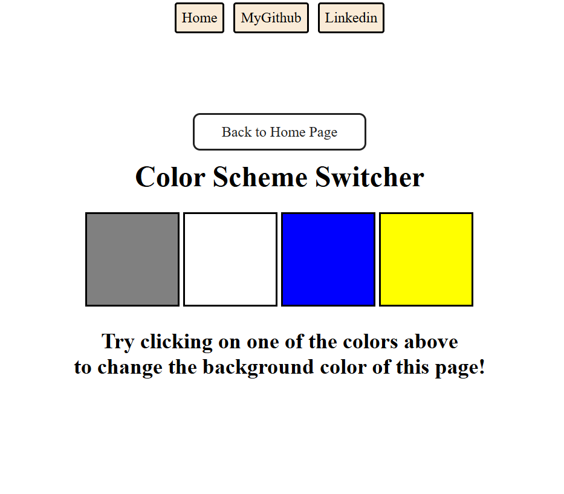
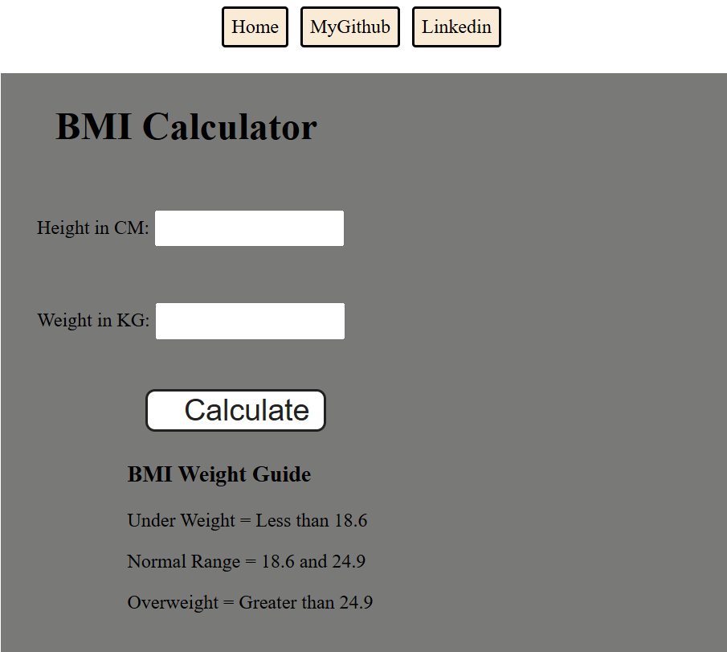

# 🎯 DOM Mini Projects - Part of My `javascript_diary` 🚀

This folder contains a series of small but meaningful DOM-based JavaScript projects that are part of my learning journey. These mini projects help reinforce concepts like event handling, DOM traversal, dynamic styling, and user interactivity. Stay tuned — more projects are on the way! 🔥

---

## 📁 Projects in This Section

### 🔵 1. Color Scheme Switcher 🎨

A simple but interactive tool to change the background color of the webpage using JavaScript and DOM manipulation.

**GitHub Link:** [color_Changer Folder](./color_Changer/)

**Preview:**

🎥 [Watch a short video demo](./color_Changer/colorChanger.mp4)

---

### 🧮 2. BMI Generator 📏

A BMI calculator that takes height and weight input from the user and shows the Body Mass Index along with a health message (Underweight, Normal, Overweight, etc.). Great for learning how to fetch input, perform calculations, and show output using DOM.

**GitHub Link:** [BMI_generator Folder](./BMI_generator/)

**Preview:**

🎥 [Watch a short video demo](https://your-video-demo-link.com)

---

## 💡 Learning Outcomes

- 🎯 Practiced real-time DOM manipulation
- 🧠 Strengthened event listener usage
- 🧪 Applied JS to real-world UI interactions
- 🌗 Implemented theme toggles using localStorage
- 📚 Improved folder & project organization

---

## 🚀 More Projects Coming Soon

This is just the beginning! I will keep updating this repo with more interesting DOM projects
---

## 🙌 Connect with Me

- 💼 [LinkedIn](https://www.linkedin.com/in/gaurav--vashistha/)
- 💻 [GitHub](https://github.com/CodeWith-Gaurav)

---

> 📌 *Follow this repo to stay updated with new projects and improvements!*
